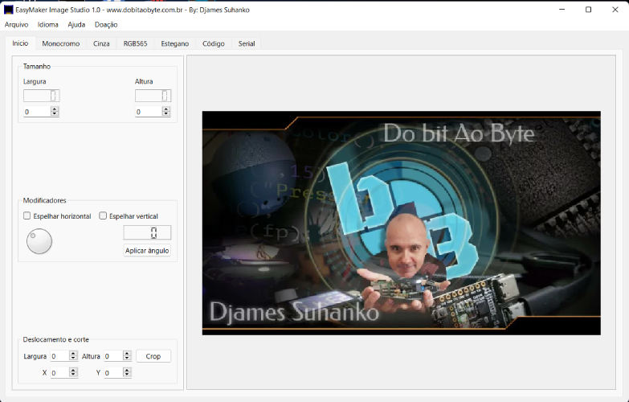
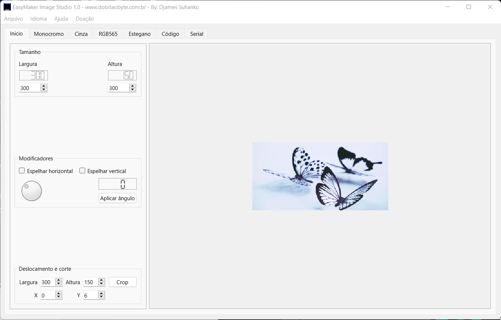
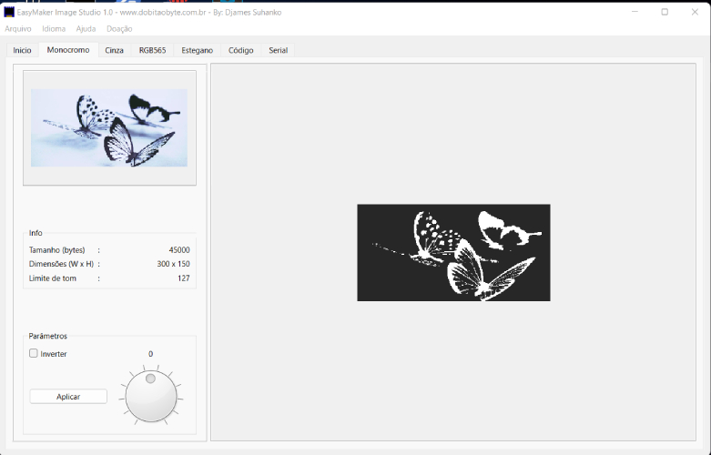
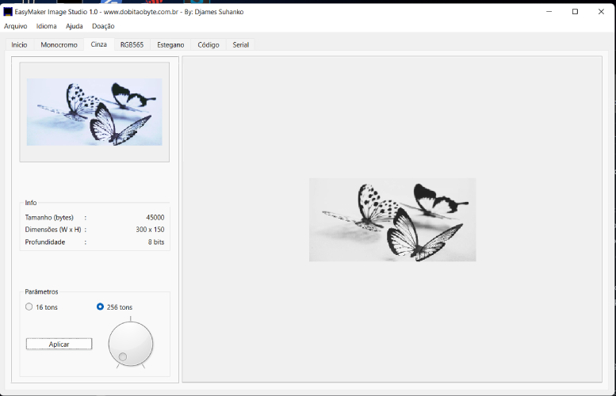
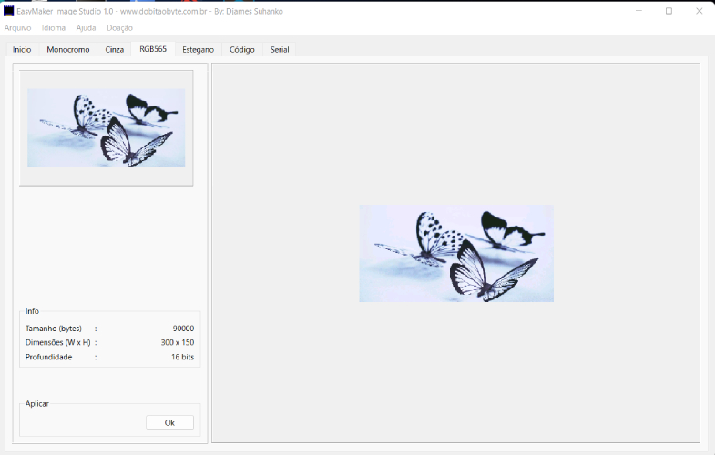
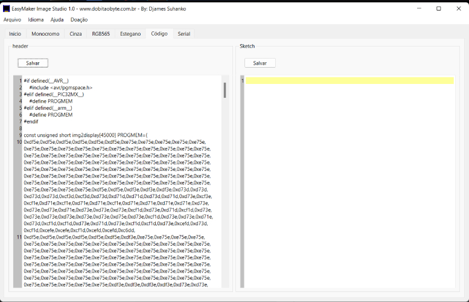
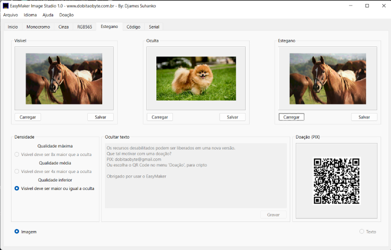

# EasyMakerImageSuite
The new suite to projects maker using displays

## About this program
This program is made using Qt as C++ framework. The use is free, but you can 'buy me a coffe'.

### Setup
All you need to to is install the application. When finished, you can choice to start imediately or you can do it later, accessing The system menu on Windows.
I'm building a Linux version yet, with no changes in source code, but to Linux we will have a static binary. When done, I update this description.

### Usage
The usage is very simple and fun. First, you will scare with a image showing my face. The program starts on "Inicio" tab ("Start" tab). I need to finish some features, as tranlation. Sorry.
The controls will be enabled after load an image, from "Arquivo" menu, then you can choice between Open Local or Download. The Idioma menu is not working yet, as I said before.
In all program you will find features not implemented yet. I will explain about "working" features.

But before, take a look on initial screen:

In this screen you can adjust the dimensions of your image. In Tamanho (Dimension) adjust until the gets very close the desired size. Then, displace and crop as you wish. Done to start convertion!
An example of adjustment:

Next step, you need to choice a conversion. The conversion is started imediately when you do click in a tab. Let's get start it with the second tab.

### Monochrome

In this tab, you can found informations about the changes made before. Size, dimensions and limits to consider black or white pixel. This conversion is useful to [displays OLED 0.9 and 1.3 inches](https://www.dobitaobyte.com.br/display-oled-com-mesmo-endereco-na-rpi-pico/), or the [e-ink MH-ET](https://www.dobitaobyte.com.br/display-e-ink-com-esp32-da-mh-et-live/). This e-ink display is only monochrome too.
I don't know if the generated code is useful to Nokia displays. Let me know, if you try it.
Another important widget here is the checkbox "Inverter". You can invert the black and white colors!

I will speak about code to display soon, don't worry.

### Grayscale

Oh, man! Seems so simple, but grayscale convertion have a lot of characteristics. If you are using a [T5 display](https://www.dobitaobyte.com.br/display-e-paper-t5-em-5-minutos/), probably you never has made an image to play with. The grayscale used in this display is called "4 bit nibbles". Very complicated to explain, but I solved the problem to you. Just Click in Grayscale (Cinza) tab and see the magic happening.
The image 4 bits will look strange and darker then normal image. Don't worry. It's exactly what you need to see on a normal computer!

If you whish a grayscale 8 bits, ok; just click on 256 tons radiobutton and click on Apply (Aplicar) button. The dial widget is just in case you wanna select the radiobutton without click. For now, is only for this.
The screen looks like that:

We are almots in the code tab, keep reading from here!

### RGB565
The RGB displays used in microcontrolers are RGB 2 bytes - or, RGB565 (5+6+5 = 16 bits - 16 bits / 2 = 2 bytes). If you search in Arduino libraries repository, you will find my EasyColor library, to make color conversion using high level libraries as LVGL and so on. Here, we can generate an image from RGB32 or RGB24, to show it on displays like [ILI9341](https://www.dobitaobyte.com.br/display-ili9341-touch/) and [ST7789](https://www.dobitaobyte.com.br/display-oled-rgb-240x240-st7789/). The links are articles in my blog.

Nothing so different of mini viewer, but needed to compare results:

### Code
Finaly, let speak about code. Each one of the converrsions will generate a respective source code in this tab. You just need to copy the sketch to a header file or directly to your sketch. If you have no idea how to use images on displays using this code, don't worry. You can found a lot of examples searching by. In my blog you will find many references too.

Here you see a code from RGB565:

The Save buttons are not connected. Maybe, in a new version can be enabled or removed. I'm not sure.
Left side you see the code generated by respective tab conversion. On the right side, you can write your sketch or any other thing you wish.

## Stegano !

Steganography is an way to hide information with safety. Using EasyMaker, you can to hide an image inside the other. There is only one way to extract it correctly: Using the EasyMaker to do that.
It's useful to hide information related to property of image or over all system where this image is alocated. Of course, you can send sensitive information via social media, then only tell the secret to the people that need to see this information.

The way to use it is:
- Load an image on Visible viewer. The image will be showed on mini viewer, but the real size is preserved.
- Load a image litle than the visible image on "To Hide" viewer. Imediately the conversion occurs. To finish, save the image showed in Stegano viewer. Unbelievable? Then test it!
- Close the program and reopen
- Load the image saved from Stegano viewer on Stegano viewer. Imediately you will see the extraction!

When you send a stegano image to someone, this people will can to save the hidden image again!

Do you see the QR Code on right side of the window? This is my PIX to make a donation of any value you wish! ANY value for this program, to motivate release new versions with more resources! But the PIX works only in Brazil, so, if you are in another country, don't worry! You can click on menu Doação (Donation) and choice between bitcoin or etherium criptocoins. The same way, any value!

In the future I thing to enable the option to hide text on image. The widgets are already in the window! :)

The last resource is a direct serial connection to upload image without to flash a new firmware. But, this Qt version has not port the QSerialPort yet. This way, it's a feature to future versions. Downloads are available clicking in the Release link of this repository. Download and try it!